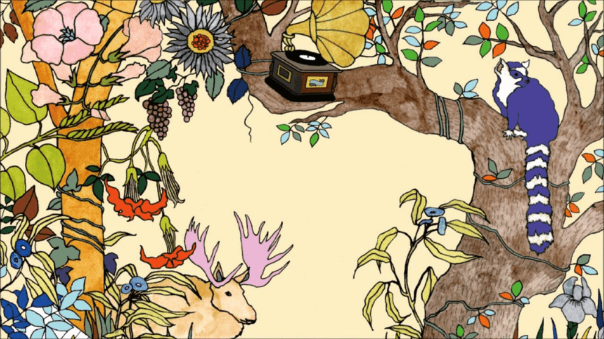

### Hi there 👋 :nerd_face:

### I'm [Adrian Huerta](https://adrhuerta.netlify.app/about/) :bowtie:

- 👨‍💻 Currently working on the development of climate gridded datasets and aridity.
- 📚 Learning everything about hydro-climatology
- 💪🏼 Future Goals: Learn more technologies - Never stop creating new ideas.
- ⚡ Fun fact: I enjoy watching movies.
<!--
**adrHuerta/adrHuerta** is a ✨ _special_ ✨ repository because its `README.md` (this file) appears on your GitHub profile.

Here are some ideas to get you started:

- 🔭 I’m currently working on ...
- 🌱 I’m currently learning ...
- 👯 I’m looking to collaborate on ...
- 🤔 I’m looking for help with ...
- 💬 Ask me about ...
- 📫 How to reach me: ...
- 😄 Pronouns: ...
- ⚡ Fun fact: ...
-->
